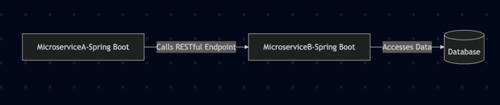

# Microservices Development and Testing Environment Prototype

## Scenario:
"Your company has a microservices architecture with 10+ services, all built around a monolithic application and DB. Engineers frequently 
complain that onboarding takes too long, setting up local dev environments is painful, getting a DB running locally is error-prone, 
and running tests across services is inconsistent."


## Problem Framing
### What are the main pain points?
- Onboarding Challenges:
  *	The process to get all necessary services and infrastructure (such as the common monolithic database) running locally is time-consuming and complex, delaying productivity for new hires.
- Local Development Environment Difficulties
  1. Environment Configuration Overhead: Setting up local dev environments is painful because of the need to replicate a complex production-like architecture locally. Dependencies among 10+ services and their interactions with a central monolith require detailed configuration.
  2. Dependencies and Service Interactions: Developers often have to deal with intricate dependency management to ensure all microservices run together as expected, which increases the chances of misconfiguration and errors during setup.
- Database Setup and Maintenance Issues
  1. Error-Prone Local DB Setup: Getting the database running locally is identified as error-prone, which could be due to: 
     * Misconfigurations between the monolith and the microservices.
     * Inconsistencies between development and production environments.
     * Complex migration or seeding processes that do not easily transfer to a local setup.
     
  2. Centralized Monolith DB: Relying on a single, monolithic database for a set of microservices increases the challenge of replicating a realistic data environment locally, potentially leading to hidden bugs or discrepancies during testing.
     * Testing Inconsistencies Across Services
     
  3. Integration Testing Challenges: Running tests that span multiple microservices is inconsistent because the tests might not accurately simulate the production environment. This can occur when:
     * Different services have varying test setups, leading to integration issues.
     * There is no standardized approach or toolset across the teams to manage testing environments, causing discrepancies in results.
  
  4. Dependence on Local Infrastructure: When tests depend on a local setup that might differ from the production environment, the tests may pass locally but fail in production due to misconfigured or non-representative environments.  


## Proposed Solution
The prototype consists of two Spring Boot "Microservice A" and "Microservice B" with the following key interactions and deployment capabilities:
* Inter-Service Communication:
  -	Microservice A calls Microservice B through a Restful API endpoint.
  -	Microservice B is responsible for interacting with a database.
  - They share a parent POM to ensure consistent dependency management and versioning.
* Deployment Options Using Docker and Docker Compose:
  - Both Services in Local Docker: Both Microservice A and Microservice B can be containerized and run locally in Docker.
  -	Both Services in IntelliJ: Alternatively, both services can be started directly from the IntelliJ IDEA development environment.
  -	Mixed Deployment: You can run one service in a local Docker container while the other is started from IntelliJ.
  -	Remote Deployment Flexibility: Either microservice can be deployed to a remote environment, allowing for more distributed deployment scenarios.



### Database migration
Java(Springboot) not give us a good way to migrate the database like NodeJS(NestJS) or .net. 
We can use Flyway or Liquibase for this purpose. In this prototype, we are using Liquibase.
There is a "db.changelog-master.xml" file in the "src/main/resources/db/changelog" directory of Microservice B.
Which contains the database schema and data changesets.
1. Create tables
2. Insert data
3. Update data
4. Delete data
5. Rollback data

It will run automatically when the application(MS B) starts.
It is a good practice to use a changelog file to keep track of the database changes.
Same, we can use this way to do any upgrade or downgrade of the database during the deployment.

**In this way, we can give minimal dataset(e.g. a dataSeed.sql) to the developers to run the application locally. This dataset can help developer
to run the application locally and run API tests.**

### How Microservices communicate
- Microservice A communicates with Microservice B using REST API calls.

When launching Microservice A, it will call the `${serviceB.url}/data` endpoint of Microservice B.
Which means can use `-DserviceB.env=local` or `-DserviceB.env=dev` to make MS A point to MS B in different environment.

### How to Run the Prototype
1. Import the project into IntelliJ IDEA. (Import parent POM as Maven project)
2. Build the project using Maven:
   ```bash
   mvn clean install
   ```
3. Run the services:
   - **Option 1: Run both services in Docker**
     ```bash
     docker-compose up --build -d
     ```
   
   - **Option 2: Run both services in IntelliJ**
     - Run DB in docker:
       ```bash
       docker-compose up --build db
       ```
     - Open the `MicroserviceAApplication` and `MicroserviceBApplication` classes and run them.
     - Given `-Dspring.profiles.active=local -DserviceB.env=local`
     
   - **Option 3: Mixed Deployment**
     - Run one service in Docker and the other in IntelliJ:
       Run DB and MS B in docker:
       ```bash
       docker-compose up --build microserviceb
       ```
       Then run `MicroserviceAApplication` in IntelliJ. 
     
   - **Option 4: Remote Deployment**
     You can launch MS A in your local IntelliJ and MS B in a remote server.
       - Make sure to set the `serviceB.url` in MS A to point to the remote server.
       - You can use `-DserviceB.env=remote` to make MS A point to MS B in remote server.
       
**Note:`-Dspring.profiles.active` can give different DB url for MS A and MS B.**
   
### Testing
#### **Unit Tests**: 

Each microservice has unit tests to verify the functionality of individual components.

"CallBControllerTest" and "DataControllerTest" which are the test classes for MS A and MS B respectively.
Here we can use **Mockito** or **SpringBoot MockMVC/@DataJpaTest(H2 db)** to mock the dependencies and test the controllers.

#### **Integration Tests**: 

Integration tests are included to verify the interaction between microservices and the database.

"CallBIntegrationTest" and "DataIntegrationTest" which are the API test classes for MS A and MS B respectively.
  * "MicroserviceBIntegrationTest":  Regression test for MS A call MS B. Have to run MS B in some place(remote/docker/local) and MS A api test will call it
  * "DataControllerIntegrationTest":  Regression test for MS B. Using **TestContainer** to run the DB in API test embedded docker and run the test.

For microservice A, 
Run
```bash
 cd microservice-a
 
 mvn clean test  -DserviceB.env=local
```

For microservice B,
```bash
 cd microservice-b
 
 mvn clean test
```


## Pains resolved by this prototype
1. Onboarding Complexity
    - Rapid Setup: Developers can quickly run local instances of both microservices without manually configuring each dependency, significantly reducing the time required for onboarding.
    - Consistent Environment: With a shared parent POM and standardized dependency management, new team members face fewer surprises regarding version mismatches or configuration drift.

2. Local Development Environment Challenges
    - Multiple Deployment Options:
        * Docker Deployment: By containerizing both microservices and the database, developers can start a complete environment with a single docker-compose command.
        * IDE-Based Deployment: Services can also be run directly from IntelliJ IDEA, making it flexible for debugging and rapid local changes.
        * Mixed/Remote Options: The prototype also supports mixed (one service in Docker, the other in the IDE) and remote deployment scenarios, which helps simulate production environments more accurately.
    
    **This flexibility allows developers to focus on the service they are working on without needing to run the entire system locally.**

3. Database Setup and Migration Difficulties
    - Developer can choose to connect to database locally (Docker) or on a remote server(DEV or TEST env).
    - Liquibase Integration for Database Migration: 
      * Use of Liquibase (via a `db.changelog-master.xml` file) automates database schema changes, data seeding, and rollbacks. 
      * This ensures that local environments are set up with a consistent, minimal dataset and reduces errors related to manual database configuration.

4. Profile-Based Configurations:
   - By using different Spring profiles (via -Dspring.profiles.active), the solution can dynamically provide the correct database connection URLs and other environment-specific settings for both local and remote deployments.

5. Testing Inconsistencies
   - Unit Tests: 
     
     Use tools like Mockito and Spring Boot’s testing support (e.g., MockMvc, @DataJpaTest with H2) to isolate and verify individual components, ensuring that each microservice’s functionality is robust.
     
   - Integration Tests: 
     
     Utilize Testcontainers to spin up a real (or containerized) database during tests, along with integration test classes (e.g., DataControllerIntegrationTest), to verify that services interact correctly and that changes in one service don’t break the entire system.
   
   - Flexible Test Execution:
   
     Developers can run tests locally for each microservice or run regression tests that verify interactions between microservices, ensuring consistency across different deployment environments.


## Can be improved but not in prototype
- Comprehensive Documentation and Sample Code:
  
In addition to the minimal dataset example currently provided, offer more detailed documentation, environment configuration guidelines, and video tutorials. This will help new engineers get up to speed faster.

- Automated Demo Environment:
  
Provide an online, pre-configured sandbox environment (or use **AWS ECR** as deployment samples) where developers can debug and validate without relying on local setups.

- Dedicated Testing Database Tools:
 
Leverage tools such as TestContainers—which is already partially utilized—to further isolate the database testing environment. Alternatively, consider using cloud-based development database services to alleviate local debugging challenges.

- Automated Testing and Deployment:

Implement CI/CD pipelines to automatically build, test, and deploy the application. This automation minimizes discrepancies between local and production environments.

- Service Virtualization/Mocking: 

Utilize tools like **WireMock** to simulate microservice interfaces. This reduces the dependency on actual services during development and testing, thereby improving efficiency.  
**Localstack** can be used to simulate AWS services, allowing developers to test cloud interactions without needing access to the actual services.

## How to Measure Success
### Onboarding Efficiency

   - Time to Productivity: Track how long it takes new hires to set up their local environment and make their first successful commit. Reductions in this metric indicate improved onboarding. 
   - New Hire Feedback Scores: Use surveys or one-on-one interviews to measure overall satisfaction with the onboarding process and ease of environment setup. 
   - Onboarding Documentation Usage: Monitor access and usage analytics on the onboarding documentation and video tutorials. Increased usage can correlate with more streamlined onboarding.

### Local Development and Testing Efficiency

   - Setup Time Reduction: Measure the average time developers spend configuring local environments before they can start coding. A significant reduction shows that containerized deployments and standardized configurations are working.
   - Error/Issue Tracking: Track the number of setup or configuration issues logged (e.g., in issue trackers or developer forums). A decline in these issues would indicate the success of the solution.
   - Test Execution Metrics: Monitor the stability of integration and unit tests. Fewer test failures caused by misconfiguration or dependency issues on local setups would be a positive sign.
   - Deployment Success Rates: Record the success rates of local, mixed, and remote deployments. If deployments (both local and via Docker/CI pipelines) consistently succeed without environment mismatches, it demonstrates improvement.

### Database Management and Migration

   - Migration Failure Rates: Measure the number of issues or rollbacks encountered during local database migrations using Liquibase or other tools.
   - Data Consistency: Use automated tests to validate that the database state matches expectations after migrations and seeding. Consistent test results indicate a robust migration strategy.

### Overall Developer Productivity and Satisfaction

   - Developer Net Promoter Score (NPS): Periodically survey your team to determine overall satisfaction with the development and testing environments. An increase in the NPS score is an indicator that the pain points are being effectively addressed. 
   - Cycle Time Metrics: Track development cycle times (e.g., time from commit to deployment/test result) to determine if faster local setups and automated pipelines are improving overall productivity.


## How to Gather Feedback

### Surveys and Polls
  * Periodic Surveys: Send out quarterly or bi-monthly surveys to collect feedback on the onboarding process, local development setup, and testing environment. Questions can focus on ease of use, setup time, and overall satisfaction.
  * Pulse Surveys: Short, frequent surveys (e.g., after major changes or deployments) can help capture immediate feedback.

### Direct Developer Interviews/Retrospectives
  * One-on-One Interviews: Schedule regular check-ins with new hires and current team members to gather detailed, qualitative insights into what is working and what needs improvement.
  * Team Retrospectives: Use Agile retrospectives to discuss what improvements have been seen and where challenges still exist. This can be done at the end of sprints or project milestones.

### Issue and Ticket Tracking
  * Internal Ticketing System: Analyze support tickets, internal bug reports, or issues submitted via issue tracker related to environment setup, deployment, or testing failures.
  * User Forums/Chat Channels: Monitor dedicated channels (e.g., Slack or Teams) for recurring issues and questions related to development setup. These can indicate areas that need further refinement.

### Analytics and Logging
   * CI/CD Dashboard Metrics: Monitor deployment logs and build times within CI/CD pipelines. Long build times or frequent failures might indicate areas that still require optimization.